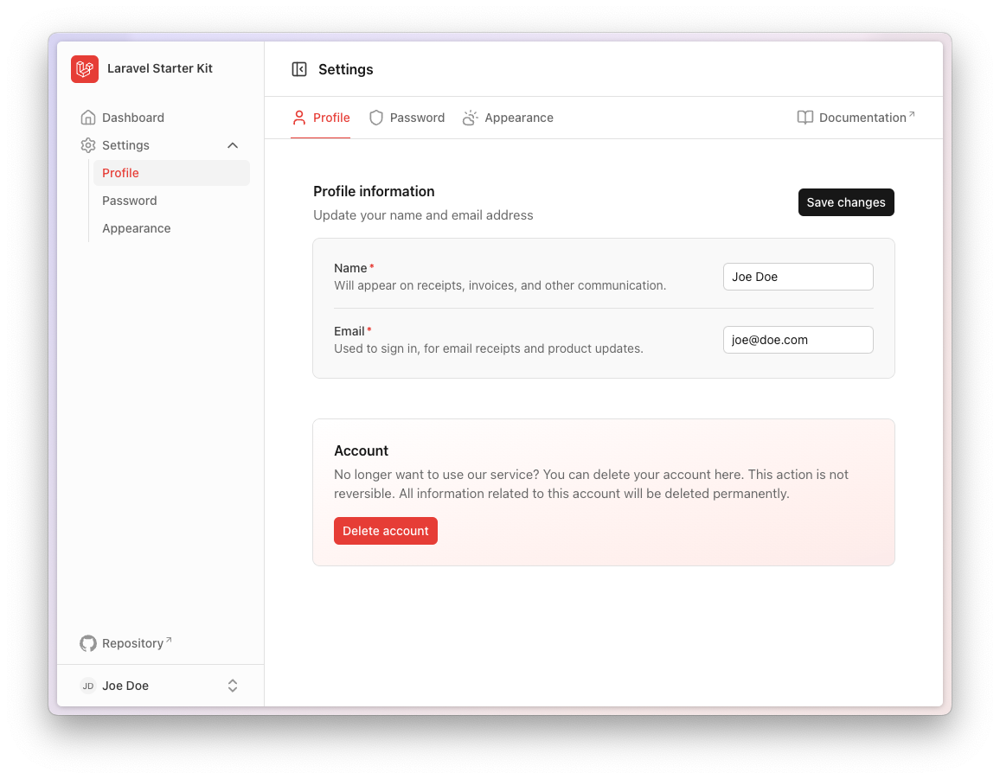
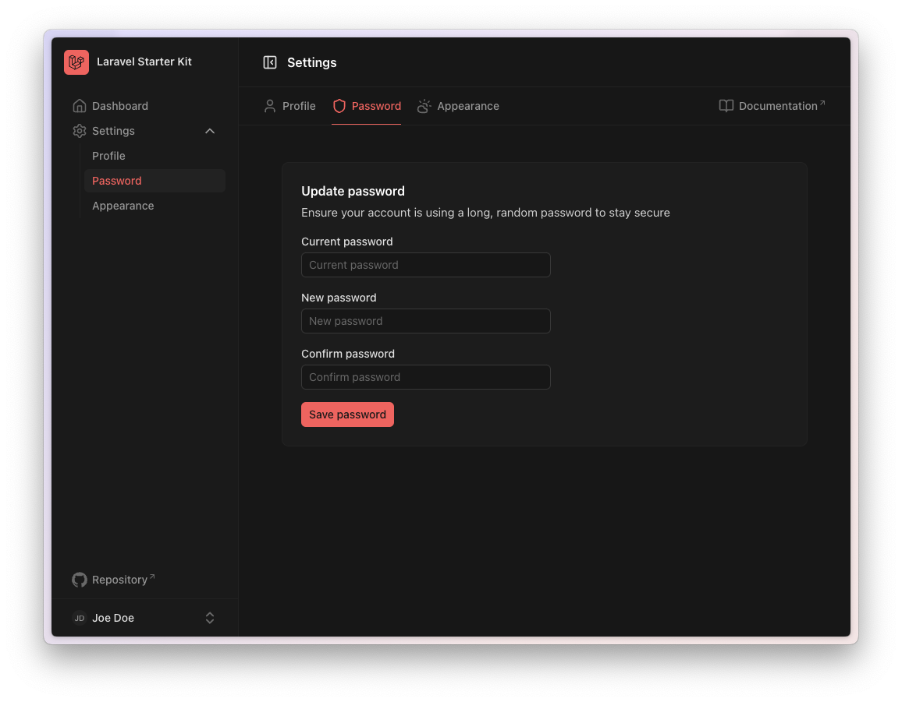

# Laravel + Nuxt UI Starter Kit

## Introduction

Nuxt UI starter kit provides a robust, modern starting point for building Laravel applications with a Vue frontend using [Inertia](https://inertiajs.com).

Inertia allows you to build modern, single-page Vue applications using classic server-side routing and controllers. This lets you enjoy the frontend power of Vue combined with the incredible backend productivity of Laravel and lightning-fast Vite compilation.

This Vue starter kit utilizes Vue 3 and the Composition API, TypeScript, and the [Nuxt UI](https://ui.nuxt.com) component library.

> [!IMPORTANT]  
> Nuxt UI v4 is currently in alpha and **not ready for production use**. You can track its progress here: https://github.com/nuxt/ui/issues/4488

## What's inside?

This starter kit is based on [laravel/vue-starter-kit](https://github.com/laravel/vue-starter-kit) and includes the following features:

- Authentication pages:
    - Login
    - Register
    - Forgot Password
    - Reset Password
    - Confirm Password
    - Verify Email
- Dashboard page
- Settings pages:
    - Profile
    - Password
    - Appearance

## Installation

You can set up this starter kit in two ways:

### Option 1: Install via Laravel Herd

One-click installation with [Laravel Herd](https://herd.laravel.com):

<a href="https://herd.laravel.com/new?starter-kit=sti3bas/laravel-nuxt-ui-starter-kit"></a>

### Option 2: Install via Laravel Installer

Create a new Laravel application using the official [Laravel Installer](https://laravel.com/docs/12.x/starter-kits#community-maintained-starter-kits):

```bash
laravel new my-app --using=sti3bas/laravel-nuxt-ui-starter-kit:v4.x-dev
```

## Screenshots





<details>
<summary>Dark mode</summary>





</details>

## License

The Laravel + Nuxt UI starter kit is open-sourced software licensed under the MIT license.
